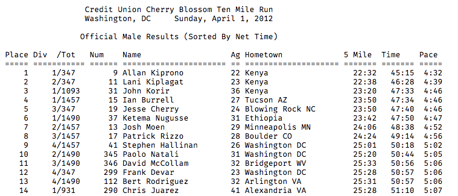
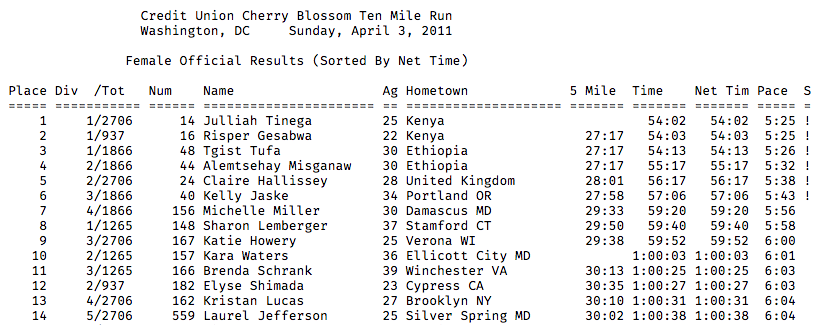

# Scraping Race Results from the Web {#scraping}

The race results for the Cherry Blossom Ten Mile Run are available at http://www.cherryblossom.org. The results for men in, e.g., 2012, are displayed in the screen shot in Figure \@ref(fig:menresults). We see that the data are simply formatted in what appears to be a block of plain text arranged in fixed-width columns. We can examine the source code for the Web page to check if this is the case. We do this in, e.g., a Google Chrome browser by clicking on View -> Developer -> View Source. When we do this we see that the table itself contains no HTML markup, and it has been inserted into a `<pre>` node within the document. It should be very easy to extract this “table” from the HTML for further processing.

```{r menresults, echo=F, out.width='100%', fig.cap="Screen Shot of the Source for Men’s 2012 Cherry Blossom Results. This screen shot is of the HTML source for the male results for the 2012 Cherry Blossom road race. While the format is not quite the same as the female results for 2011, both are plain text tables within `<pre>` nodes in an HTML document."}

```

We examine one more year to ascertain if the format is the same. When we view the source for the page of 2011 women’s results, we see that the basic format is the same. A screen shot of the source for 2011 female results appears in Figure \@ref(fig:womenresults). However, the columns are not identical. In 2011, a net time is reported as well as a time. And, following the pace column there is a column labeled `S`, which has an exclamation mark for the first few runners and nothing for the rest. Our task here is simply to extract the text table so we need only locate the table and extract it as a block of text. The functions in Section 2.3 take care of turning the columns of information into variables.

```{r womenresults, echo=F, out.width='100%', fig.cap="Screen Shot of the Source for Women’s 2011 Cherry Blossom Results. This screen shot is of the HTML source for the female results for the 2011 Cherry Blossom road race. Notice that times given are for the midpoint of the race (5 Mile) and for two finish times (`Time` and `Net Tim`). Also notice the rightmost column labeled `S`. While the format is different than the male results for 2012, both are plain text tables within `<pre>` nodes in an HTML document."}

```

We use the `read_html()` function in the `rvest` package to scrape the 2012 men's page from the site.

```{r}
ubase <- 'http://cherryblossom.org/'
url <- paste0(ubase, 'results/2012/2012cucb10m-m.htm')
doc <- read_html(url)
```

We saw from the HTML source that we want to extract the text content of the `<pre>` node. We can access all `<pre>` nodes in the document with the CSS selector `pre`.

```{r}
pre_node <- html_nodes(doc, 'pre')
```

The `html_nodes()` function a list where each element corresponds to one of the `<pre>` nodes in the document. In our case, there is only one such node. Next, we use the `html_text()` function to extract the text content from this node as follows:

```{r}
txt <- html_text(pre_node)
```

Let's examine the contents of `txt`. We first determine how many characters it contains and then examine the start and end. We do this with

```{r}
nchar(txt)
```

```{r}
str_sub(txt, 1, 50)
```

```{r}
str_sub(txt, nchar(txt) - 50, nchar(txt))
```

It appears that we have successfully extracted the information from the web page. We also see that the individual lines end with `\r\n`. We can use these characters to split up the 690904 characters into separate strings corresponding to lines in the table. That is,

```{r}
els <- str_split(txt, '\\r\\n')[[1]]
```

Now we have 7202 lines of information, i.e.,

```{r}
length(els)
```

The first few of these contain the header information, i.e.,

```{r}
head(els, 3)
```

and the last line is actually blank, but the line before that contains information for one of the runners:

```{r}
tail(els, 3)
```

We have succeeded in extracting the rows of the table as elements of a character vector.

Let's formalize our code into a function that we can apply to each of the 28 Web pages (a page for each of the men’s and women’s races from 1999 to 2012). We want our function to take as input the URL for the Web page and return a character vector with one element per line, including the header lines and the rows in the table of results. We arrange our previous code into a function as

```{r}
extract_res_table <- function(url) {
  read_html(url) %>% 
    html_nodes('pre') %>% 
    html_text() %>% 
    str_split('\\r\\n') %>% 
    .[[1]]
}
```

Let's try our function with the 2012 men's results.

```{r}
m2012 <- extract_res_table(url)
identical(m2012, els)
```

Our function has extracted the same results as before. Let's now apply it to all of the men's results across the years.

It turns out that the URL pattern is not consistent for all the years. The correct URLs are as follows:

```{r}
men_urls <- c(
  'results/1999/cb99m.html',
  'results/2000/Cb003m.htm',
  'results/2001/oof_m.html',
  'results/2002/oofm.htm',
  'results/2003/CB03-M.HTM',
  'results/2004/men.htm',
  'results/2005/CB05-M.htm',
  'results/2006/men.htm',
  'results/2007/men.htm',
  'results/2008/men.htm',
  'results/2009/09cucb-M.htm',
  'results/2010/2010cucb10m-m.htm',
  'results/2011/2011cucb10m-m.htm',
  'results/2012/2012cucb10m-m.htm'
)
```

We now construct the `urls` vector so that it contains the proper web addresses. We paste the URLs together with

```{r}
men_urls <- paste0(ubase, men_urls)
head(men_urls, 3)
```

Let's try reading the results into R.

```{r}
men_tables <- map(men_urls, extract_res_table)
```

We receive no error messages. Of course, simply because we didn't run into any errors, does not mean that we have properly extracted the data. We need to check the results to see if they contain the information expected.

Let's first check the length of each of the character vectors. From the web site we have seen that several thousand runners compete each year so we expect several thousand elements in our vectors.

```{r}
map_int(men_tables, length)
```

Hmm, the 1999, 2000 and 2009 extractions resulted in vectors with just one or two elements.

The file names for these three years are correct to this requires digging deeper. Let's look at 1999 first.

```{r}
str_sub(men_tables[[1]], 1, 200)
```

It looks like the line separators in this file are `\n` characters, not `\r\n`. This is easy enough to fix.

```{r}
men_tables[[1]] <- str_split(men_tables[[1]], '\\n')[[1]]
map_int(men_tables, length)
```

We view the source of the 2000 web page to see if it is formatted as expected. Below are the first few lines of the 2000 document, indented for better readability.

```
<html>
<body bgcolor="#CCFFFF">
 <p align="center">
  <font color="#800000" size="4" face="Arial">
    <strong>
Nortel Networks Cherry Blossom 10mile Road Race<br>
Washington, DC *** April 9, 2000
    </strong>
  </font>
  <strong>
    <font color="#800000" face="Arial">
      <br>
      <h3 align="center">
        <font color="#800000" face="Arial">
Official Results, MEN *** Gun Time Is The Official Time
        </font>
      </h3>
    <BR>
    <PRE>
      <Strong>
        </font>
        <font color="#800000" face="Courier New">
PLACE DIV /TOT  NUM   NAME                  AG ...
===== ========= ===== ===================== == ...
```

This document is not well-formed HTML. The `read_html()` function can fix many problems with malformed documents, but it can only do so much. Notice that the `<font>` and `<h3>` tags are not properly nested, and similarly the closing `</font>` tag that appears after the `<pre>` tag is problematic. If `read_html()` closes the `<pre>` tag so that the tags in the document are properly nested, then the `<pre>` node does not contain the table of race results.

We can programmatically edit the HTML so that it is well formed. Alternatively, we can try another CSS expression for locating the content for this particular file. We proceed with the second of these options and leave the first as an exercise.

If we want to handle one of the years differently than the others, then we need a way to distinguish between the two approaches. One way to do this might be to add a second argument to the function definition that indicates with which year we are working. Then our code can check the year, and if it is 2000, we can extract the table of results differently. We supply a default value to year so that if we don’t specify this argument then the function carries out the default extraction. We provide a modified `extract_res_table()` to do this:

```{r}
extract_res_table <- function(url, year = 2001) {
  # handle weird cases
  if (year == 1999) {
    read_html(url) %>% 
    html_nodes('pre') %>% 
    html_text() %>% 
    str_split('\\n') %>% 
    .[[1]]
  } else if (year == 2000) {
    read_html(url) %>% 
    html_nodes('font') %>%
    .[[4]] %>% 
    html_text() %>% 
    str_split('\\r\\n') %>% 
    .[[1]]
  } else {
    read_html(url) %>% 
    html_nodes('pre') %>% 
    html_text() %>% 
    str_split('\\r\\n') %>% 
    .[[1]]
  }
}
```

Since we now have two arguments to our function, we use `map2()` to call `extract_res_table()`:

```{r}
years <- 1999:2012
men_tables <- map2(men_urls, years, extract_res_table)
names(men_tables) <- years
map_int(men_tables, length)
```

We have cleared up the problems with 1999 and 2000, but the problem with 2009 remains. It turns out that rather than putting all the data in one `<pre>` tag, each line is contained in a separate `<pre>` tag. This means that splitting the string on newline characters is unnecessary. Here is the final modified `extract_res_table()` function.

```{r}
extract_res_table <- function(url, year = 2001) {
  selector <- if (year == 2000) 'font' else 'pre'
  regexp <- if (year == 1999) '\\n' else '\\r\\n'
  
  result <- read_html(url) %>% 
    html_nodes(selector)
  
  if (year == 2000) result <- result[[4]]
  
  result <- result %>% 
    html_text()
  
  if (year == 2009) return(result)
  
  result %>% 
    str_split(regexp) %>% 
    .[[1]]
}
```

Let's try it one more time.

```{r}
men_tables <- map2(men_urls, years, extract_res_table)
names(men_tables) <- years
map_int(men_tables, length)
```

Now that we have the function working for the Web pages of men’s results, we can try it on the women’s pages.

```{r}
women_urls <- c(
  'results/1999/cb99f.html',
  'results/2000/Cb003f.htm',
  'results/2001/oof_f.html',
  'results/2002/ooff.htm',
  'results/2003/CB03-F.HTM',
  'results/2004/women.htm',
  'results/2005/CB05-F.htm',
  'results/2006/women.htm',
  'results/2007/women.htm',
  'results/2008/women.htm',
  'results/2009/09cucb-F.htm',
  'results/2010/2010cucb10m-f.htm',
  'results/2011/2011cucb10m-f.htm',
  'results/2012/2012cucb10m-f.htm'
)

women_urls <- paste0(ubase, women_urls)
women_tables <- map2(women_urls, years, extract_res_table)
names(women_tables) <- years
map_int(women_tables, length)
```

Everything worked except for 2009. It turns out that the HTML for the women's 2009 page is properly formed, and so we don't need the special case that we created for the men's. We'll modify our `extract_res_table()` function one more time.

```{r}
extract_res_table <- function(url, year = 2001, female = TRUE) {
  selector <- if (year == 2000) 'font' else 'pre'
  regexp <- if (year == 1999) '\\n' else '\\r\\n'
  
  result <- read_html(url) %>% 
    html_nodes(selector)
  
  if (year == 2000) result <- result[[4]]
  
  result <- result %>% 
    html_text()
  
  if (year == 2009 && female == FALSE) return(result)
  
  result %>% 
    str_split(regexp) %>% 
    .[[1]]
}
```

```{r}
men_tables <- map2(men_urls, years, extract_res_table, female = FALSE)
women_tables <- map2(women_urls, years, extract_res_table, female = TRUE)
names(men_tables) <- years
names(women_tables) <- years
map_int(men_tables, length)
map_int(women_tables, length)
```

We save the data in text files for further processing.

```{r eval=F}
dir.create('men')
dir.create('women')

walk2(men_tables,
      paste('men', paste(years, 'txt', sep = '.'), sep = '/'),
      write_lines)
walk2(women_tables,
      paste('women', paste(years, 'txt', sep = '.'), sep = '/'),
      write_lines)
```

